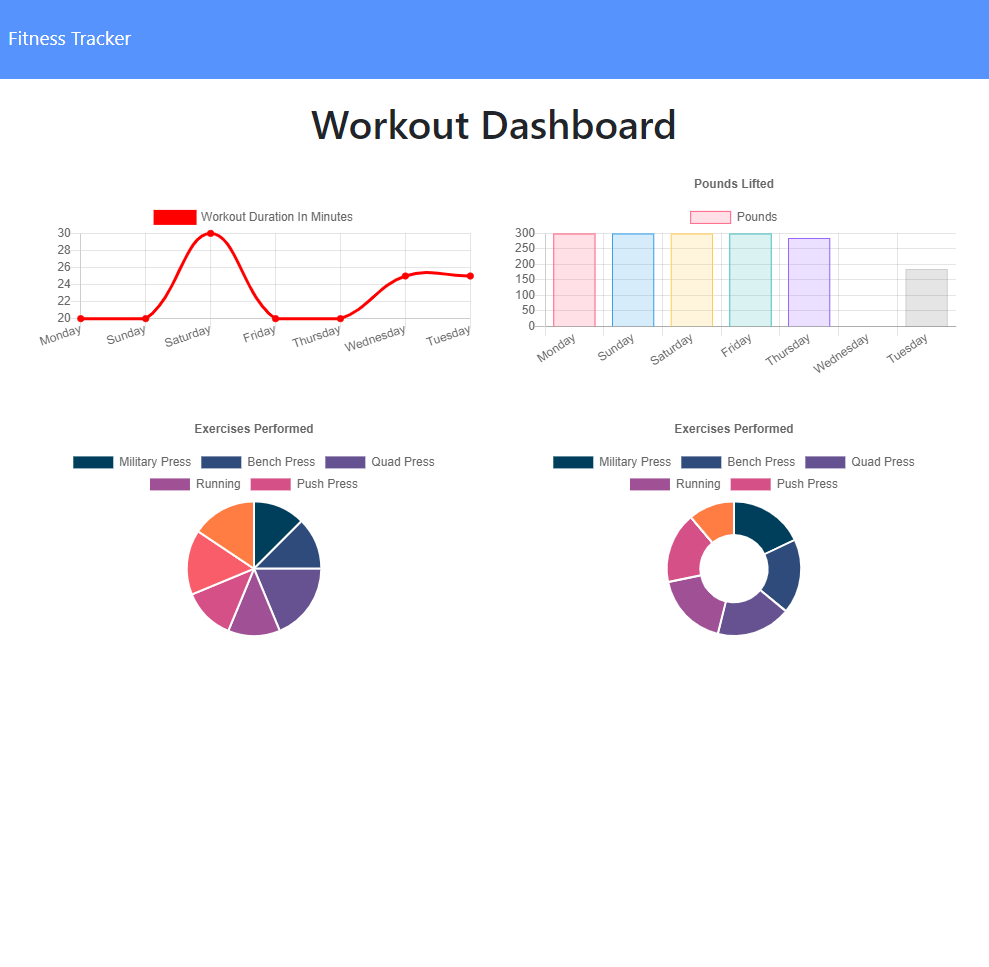

# Exercise Log
  
  ## Description
  Workout tracker that uses MongoDB with a Mongoose schema.

  Click 'Continue' to add another exercise to the current workout. Click 'New' to begin a new workout. Click 'Dashboard' in the navbar to see stats for the last 7 workouts.

  Deployed at [Heroku](https://powerful-fjord-27507.herokuapp.com/).

  See the repo at [GitHub](https://github.com/danielryangreen/exercise-log).

  
  ## Table of Contents
  * [Installation](#installation)
  * [Usage](#usage)
  * [Credits](#credits)
  * [License](#license)
  * [Contributing](#contributing)
  * [Tests](#tests)
  * [Questions](#questions)
  ## Installation
  Download and install MongoDB Community Server. Then enter `npm run seed` in the terminal to create the collection with sample data.
  
  To install required packages, enter `npm i` in the terminal.
  ## Usage
  To run the application, enter `node server.js` in the terminal and then navigate to `localhost:3000` in the browser.

  ## Credits
  The following resources were used in this project:

  - [MongoDB](https://www.mongodb.com/2)
  - [Mongoose](https://mongoosejs.com/)
  - [Node.js](https://nodejs.org/en/)
  - [Express](https://expressjs.com/)

  Front end code was provided by [Trilogy Education Services](https://trilogyed.com/).
  ## License
  This project is covered under the MIT license.
  ## Contributing
  Please submit a pull request.
  ## Tests
  Not provided.
  ## Questions
  Please contact me at dan.ryan.green@gmail.com. See my work on GitHub at [danielryangreen](https://github.com/danielryangreen/).